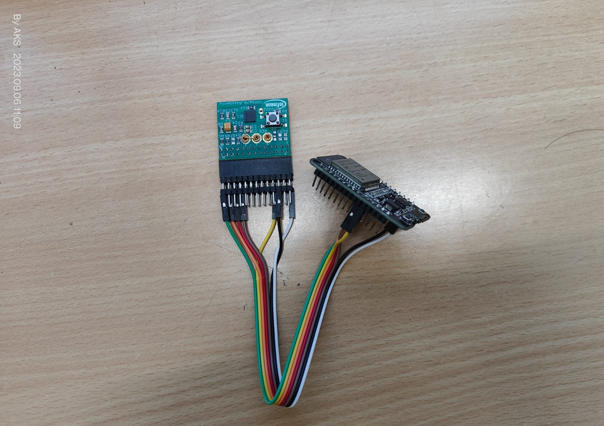
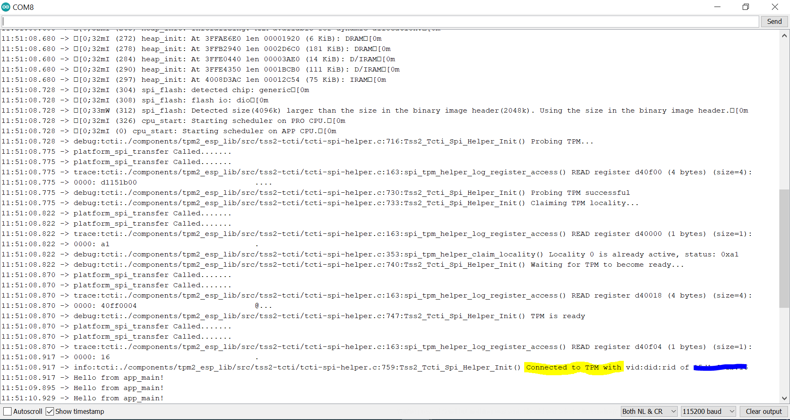

# TPM 2.0 SLB9870 with ESP32

## **Change Log Levels:**
* 0 -> LOGL_NONE
* 2 -> LOGL_ERROR
* 3 -> LOGL_WARNING
* 4 -> LOGL_INFO
* 5 -> LOGL_DEBUG
* 6 -> LOGL_TRACE

*Note: change logLevels in [CmakeList.txt](CMakeLists.txt)*

## **Hardware Connection**

## **Output Serial Windows**

## **TPM2.0 Useful Links:**

**SLB9670 Datasheet:**

https://pdf1.alldatasheet.com/datasheet-pdf/download/1421691/INFINEON/SLB9670TPM2.0.html

**TPM2-TSS Source**

https://github.com/tpm2-software/tpm2-tss

**IRIDIUM SPI Hardware Reference**

https://www.infineon.com/dgdl/Infineon-Iridium_1-0_9670_HD-AdditionalTechnicalInformation-v01_01-EN.pdf?fileId=5546d46271bf4f920171ef70667e51b4

**SPI Helper**

https://github.com/tpm2-software/tpm2-tss/blob/master/doc/tcti-spi-helper.md